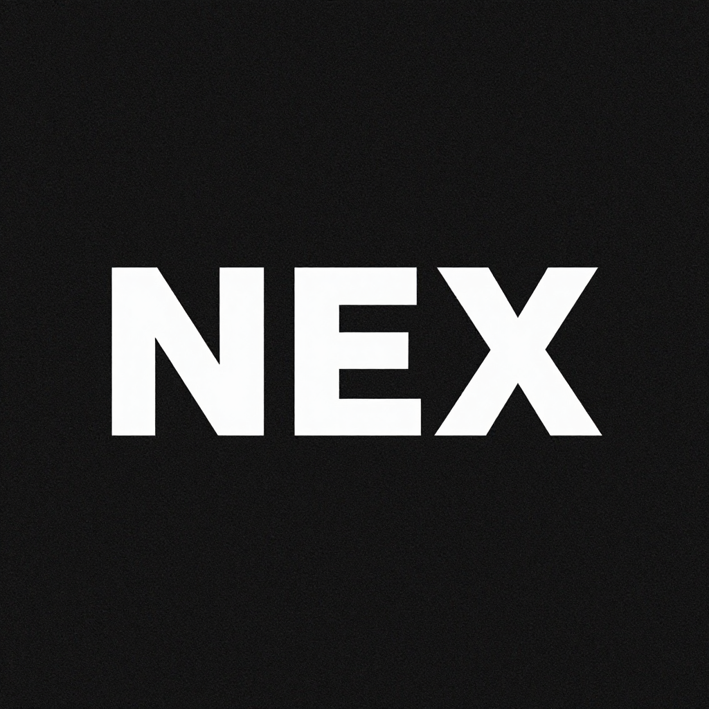

<div align=center>

<h2>NexDB-Skill</h2>
<p>把 AI 编程助手通过 MCP 接到 NexDB</p>
</div>

[English](README.en.md) | 中文

### 一、这是什么

- 一个给 AI Agent 用的技能（Skill）：把 [NexDB](https://github.com/Mutantcat-Working-Group/NexDB)
  的 MCP 能力——装、配、连、排错——收成一份可检索的说明。
- **兼容优先**：原生二进制、npm / npx、NexDB 桌面端 Streamable HTTP、NexDB Web / Docker
  四条通道都覆盖；Claude Code、Cursor、Codex、Windsurf、VS Code + Copilot、
  DeepSeek Harness 和通用 MCP 客户端都有现成配置片段。
- **品牌名统一为 NexDB**：`@dbx-app/mcp-server`、`dbx-mcp`、`DBX_*` 是历史内部标识，
  保持不变，避免破坏已有配置。
- **发行方**：异猫工作群（mutantcat.org），GitHub: https://github.com/Mutantcat-Working-Group

它解决的是什么问题：接入 MCP 最容易踩的从来不是业务参数，而是通道细节——
GUI 客户端不继承 PATH、桌面 HTTP 服务默认关闭、权限只在 NexDB 设置里管、
Web/Docker 的 `Host` 要对齐、macOS 钥匙串要单独授权。这些坑每接一次都要重踩，
所以固化成文档。

### 二、四条通道

| 场景 | 通道 | 启动方式 |
| --- | --- | --- |
| 本机桌面，想要最快最稳 | 原生二进制（推荐） | `dbx-mcp` 绝对路径，stdio |
| 已有 Node 环境，图省事 | npm / npx | `npx -y @dbx-app/mcp-server`，stdio |
| 只想开一个本机 HTTP 端口 | NexDB 桌面 Streamable HTTP | `http://127.0.0.1:5225/mcp` + Bearer Token |
| 连远程 / 容器里的 NexDB | NexDB Web / Docker | `DBX_WEB_URL` 走 stdio，或 Web 自带 `/mcp` |

### 三、安装

作为技能使用，把本仓库放进 skills 目录即可：

```bash
git clone https://github.com/Mutantcat-Working-Group/NexDB-Skill.git \
  ~/.codex/skills/nexdb-mcp
```

然后先装 NexDB MCP 服务端本体（无需 Node.js，推荐原生）：

```bash
# macOS / Linux
curl -fsSL https://dbxio.com/install-mcp | sh
```

```powershell
# Windows PowerShell
irm https://dbxio.com/install-mcp.ps1 | iex
```

脚本会校验下载内容，把 `dbx-mcp` 装到 `~/.dbx/bin`，并直接打印 Claude Code、
Cursor、Codex 和通用客户端配置。重跑同一条命令即升级。macOS / Linux 也可以用
Homebrew：

```bash
brew install t8y2/tap/dbx-mcp
brew upgrade t8y2/tap/dbx-mcp
```

**GUI 客户端要填展开后的绝对路径**，不要填 `~` 或裸命令 `dbx-mcp`：
客户端不一定继承 shell 的 PATH。

### 四、快速上手

最省事的一条：用 npx，不装任何全局包。

```json
{
  "mcpServers": {
    "dbx": {
      "command": "npx",
      "args": ["-y", "@dbx-app/mcp-server"]
    }
  }
}
```

原生二进制写法：

```json
{
  "mcpServers": {
    "dbx": {
      "command": "/Users/you/.dbx/bin/dbx-mcp"
    }
  }
}
```

连上后直接用自然语言：

```text
列出我的 NexDB 连接
查看 local-pg 上有哪些表
查看 users 表的结构
查询最近 7 天的订单数量
打开 orders 表            （需要 NexDB 桌面端运行中）
```

### 五、权限在 NexDB 里管

**NexDB Settings → MCP** 保存唯一权威策略，每个请求都重新读取：只读 / 数据读写 /
完全访问三档，另有连接 allowlist、每连接的数据库范围和工具 allowlist。

**不要在客户端配置里放权限开关。** `DBX_MCP_ALLOW_WRITES`、
`DBX_MCP_ALLOW_DANGEROUS_SQL` 只用于升级兼容，不能放宽中央策略；
`DBX_MCP_SCOPE_*` 只能进一步收窄范围。

### 六、文档地图

| 文件 | 内容 |
| --- | --- |
| [SKILL.md](SKILL.md) | 技能主体：选通道、装、配、安全边界 |
| [references/clients.md](references/clients.md) | Claude Code / Cursor / Codex / Windsurf / VS Code / DSH / 通用客户端配置 |
| [references/connection-modes.md](references/connection-modes.md) | 四条通道、环境变量、连接存储路径、驱动与 Agent 依赖 |
| [references/tools.md](references/tools.md) | 工具清单、参数要点、会话与事务、Salesforce、插件工具、Resources |
| [references/troubleshooting.md](references/troubleshooting.md) | 连不上、权限报错、钥匙串、Docker、驱动问题的排查手册 |

### 七、安全边界

- 本地模式只读 NexDB 自己保存的连接配置；查询是否执行、能不能写，全部由
  **NexDB Settings → MCP** 决定。
- 桌面 Streamable HTTP 默认只监听回环地址，Token 轮换立即生效。
- Web / Docker 模式请用 `DBX_WEB_MCP_TOKEN_FILE` 或部署平台 Secret 管理 Token，
  不要把真实 Token 提交进仓库。
- 这个技能会引导执行删除、DDL、批量写入等不可逆操作，动手前先向使用者确认。

### 八、许可

Apache-2.0，见 [LICENSE](LICENSE)。
